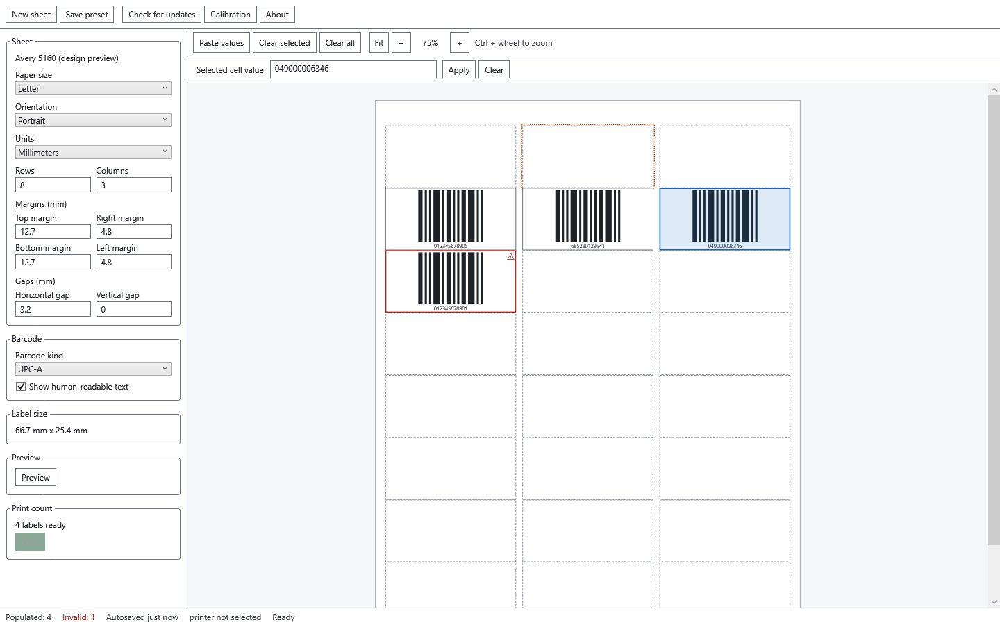

# Arsi Barcode Sticker Printer

Print barcode labels on ordinary sheets — no special software skills needed.

Pick a paper layout, type in your values, preview the sheet, and print. Empty spots on the sheet are skipped automatically, so you only print what you fill in.

## Features

- Works with A4, A5, Letter, or your own custom sheet size
- Supports Code 128, Code 39, EAN-13, and UPC-A barcodes
- Type values in one at a time, or paste a whole list at once
- See an exact print preview before you print
- Built-in calibration if your labels print slightly off-position
- Free to use, for personal and business printing

## Download and install

1. Download the latest `Setup.exe` from the [Releases](releases) page.
2. Run it and follow the on-screen steps.
3. Launch **Arsi Barcode Sticker Printer** from your Start menu or desktop.

**Windows may show a warning** the first time you run it, because the app isn't digitally signed yet. This is expected — click **More info**, then **Run anyway**. Only download the app from this page.

To uninstall, go to **Settings > Apps > Installed apps**, find the app, and choose **Uninstall**.

## Updates

The app checks for new versions automatically and lets you know when one is available. Updating is optional and only happens when you choose **Download**.

## Your data stays on your computer

Arsi Barcode Sticker Printer doesn't collect analytics, doesn't require an account, and doesn't send your label data anywhere. It only connects to the internet to check for updates.

## Need help?

- Website: https://arsi.in
- Email: contact@arsi.in

Copyright © 2026 Arsi Consultancy. Free to use — see [LICENSE.txt](LICENSE.txt) for details.
